##Guide to Projectors for Interactive Installations </h2>
#### Original Text by [Blair Neal](http://blairneal.com) 2014

Video projectors are one of the most important tools for creators of interactive installations. The information for projectors is available on various websites, but this 2 part guide will focus on their use in production and interactive environments. Part 1 will focus on the projector as hardware(lenses, lumens, surfaces etc), and part 2 will go into more details on the software and calibration considerations. This will gather some of that disparate knowledge into the important bits you need to make informed decisions about creating a high quality experience.

They vary in scale from pocket-sized (or smaller) pico's to refrigerator sized large-venue projectors. They vary in price from a couple hundred dollars, to a couple hundred thousand dollars. In the end, however, essentially all projectors can be described as little more than a bright light element,  imaging elements, and a lens. There is something technical about projectors that seems to mystify some people, but it is really important to remember that they are just a flashlight that shoots a square shaped image. In this article we will discuss:
<ul>
	<li>A checklist for planning your installations</li>
	<li>Overview of projector types</li>
	<li>Different classes of projectors</li>
	<li>How to calculate projector intrinsics/How to read and interpret a spec sheet</li>
	<li>How to calculate proper brightness</li>
	<li>Discussion of video signal quality and cable lengths</li>
	<li>Maintenance, Miscellaneous caveats and tricks of the trade</li>
	<li>Experimental tech and the future</li>
	<li>References and Thanks</li>
</ul>
<h1>Projection Planning Checklist:</h1>
Here is a sample checklist that you can go through when planning to choose a projector for an interactive installation or large event. Each decision made here has it's own list of caveats and considerations that can affect the final outcome. Some of these topics will be covered more in depth later on:
<ul>
	<li>What is the surface or object you'll be projecting on?</li>
	<li>Standard screen? Front or rear projection?</li>
	<li>Fabric or scrim?</li>
	<li>What color is the surface?</li>
	<li>What are you projecting on? Flat surface or complex geometry? Is it an unusual shape/curved/architectural/sculptural</li>
	<li>What is the environment like?</li>
	<li>Inside or outside? Daytime or nighttime?</li>
	<li>How much ambient light is there? Is it a bright show room, or a dim purpose-lit space? Is there lighting design?</li>
	<li>How will you mount or place the projector?</li>
	<li>Will the venue allow you to drill into the ceiling?</li>
	<li>How will you run cleanly run cables from your command station to the projectors? (More on cable lengths later)</li>
	<li>Where are people (or other objects?) going to be in relation to the projectors?</li>
	<li>Is there a potential for shadows?</li>
	<li>What image size are you trying to achieve?</li>
</ul>
Visiting the installation space in person is optimal when starting to plan. A visit will get you the best sense of space, available electrical outlets, positioning options and the sense of ambient light. Pictures and CAD drawings of the space are next in line of importance of things you should obtain for the space, even if you visit it. After that, it's up to you if you want to sketch out placement on paper, model their placement in a 3D rendering, or make a scale diorama.

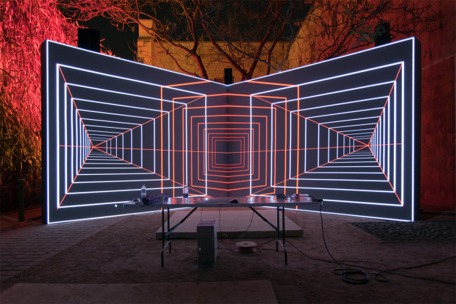

<small><a href="http://www.creativeapplications.net/environment/onion-skin-by-antivj-re-composition-of-time-and-space-using-perspective/">Onion Skin by Olivier Ratsi [Antivj</a>] – Re-composition of time and space using perspective</small>
#Overview of Projector Types
There are several different kinds of imaging and illumination methods used in video projectors, and each type has their own list of pros and cons. Each technology uses a different combination of light sources, mirrors, filters and lenses. Below, I'll briefly explain each type, and you can check out some links in my sources for further reading:
##DLP
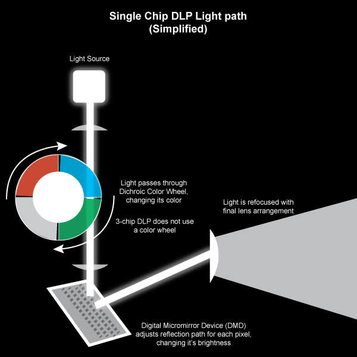

This is one of the most commonly used projector types, and they often provide the most bang for your buck. A big selling point on DLP technology is that it can display much darker blacks than LCD technology which is especially helpful for illusions like projection mapping. There are a few different styles of DLP, Single chip and 3-Chip. In single chip DLP,  a light source is passed through a rapidly spinning multi-segment color wheel of 3 or more dichroic glass sections (7 or more color segments is a more "desirable" spec than 3). That light then bounces off a matrix of electrically controlled microscopic mirrors that determine the brightness of each individual pixel. The beam then passes through filters and out through a lens. The timing between the color wheel and the movement of the mirrors determines the color of the output.

With DLP projectors, the most noticeable side effect of this imaging method is a RGB effect that appears when you quickly move your eyes side to side. You will also notice a subtle rainbow banding effect if you capture the projection through certain types of cameras, especially CMOS DSLR's. You can minimize this effect by adjusting your camera's shutter speed to be slower. This banding effect is minimized or non-existent on 3-chip DLP projectors that split the light path in a similar way to how LCD projectors work so it syncs colors without a color wheel. A 3-chip DLP is a little more expensive though, and you'll mostly find it on cinema projectors and ones with more than 10k lumens.
##LCD
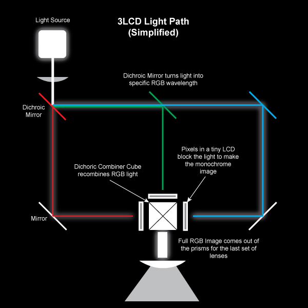
There are a couple different LCD technologies for projection, but 3LCD is probably the most recommended in terms of image quality. With LCD projection, a light source is bounced through 3 dichroic filters that turn the white light into precise red/green/blue frequencies. Those differently colored beams of light then pass through liquid crystal arrays that turn on and off their pixels and block the different light patterns to form the image. Those LCD's are then recombined with a prism that recombines the 3 colored segments into a single light beam/image that then passes through a lens. Whew. LCD projection doesn't have the rainbow banding effect that DLP does and tends to be easier to film, but it doesn't have the darkest blacks, so it doesn't disappear as much when the screen is just displaying a black image.

LCD Projector Teardown Video: [Youtube Link](http://www.youtube.com/watch?v=ieJJUhJkyBc)
##LCoS
Liquid crystal on silicon is almost a hybrid of how DLP and LCD work, and can provide advantages over both. LCoS has a reflective portion, but is also modulated by liquid crystal. There is no color wheel in this setup, as it does the light splitting technique similar to LCD. The primary current issue with this technology is that the contrast ratio tends to be much lower than DLP or LCD, so your contrast range from true black to bright white is reduced.
##Hybrid
There aren't many of these yet, but a couple brands have come out with hybrid light source projectors that boast extremely long lamp life (20,000 hours compared to the normal 2-3000 hours of a traditional lamp). These still use some of the traditional imaging sources as above, like DLP and LCD, but they replace their lamp bulb with a different solid state source like LED, Laser, etc etc.
##Laser Diode
This is another fairly new player that isn't wide spread yet. I've seen it in a new <a href="http://pro.sony.com/bbsc/ssr/show-projectors/resource.solutions.bbsccms-assets-show-projectors-laserprojectorslandingpage.shtml">Sony projector</a> and the yet-to-be released <a href="http://www.red.com/products/redray">RedRay 4K</a>. You can also find this as a light source in some of the smaller Pico projectors like Microvision's. Primary advantage of a light source like this is that you don't have to worry about heat dissipation as much as you would with a Xenon bulb.
##CRT
CRT is almost nonexistent in this day and age, but hey, maybe you want to have a vintage party with a laser disc player or something. CRT projection was used a lot in some of those large 90's era rear projection big screen TV's. They feature 3 CRT guns in red, green and blue that fire electrons onto a phosphor surface, similar to a standard CRT. Then they are passed through a lens, and onto a projection surface (typically rear projection). The guns are very sensitive about their positioning and typically require re-calibration after moving them around. They are now mostly an interesting thing to scavenge for parts.
#Different classes of projectors
Your project may be a small interactive tabletop game with a single pico projector in a dark room or a 200ft x 100ft projection bonanza with a dozen large-venue projectors. It's very helpful to know and understand the capabilities of the ranges of the pico, the portable, the installation, and the large venue projectors.
##Pico and Pocket projectors
Price range: $100-500
Brightness range: 10 lumens to 500 lumens
Resolution range: 640x480 to 1280x800
<a href="http://www.bhphotovideo.com/c/product/1007553-REG/aaxa_technologies_kp_101_01_25_lumen_led_pico.html">Example</a>

These tend to be used in very specialized situations as they tend to have a limited range on the brightness they can provide (usually less than a couple hundred lumens, if that). Don't expect to have a suitable image that is larger than a couple feet in width, even in total darkness. Pico projectors use different light sources like LED and lasers. Some even contain batteries for battery powered operation (or can be hacked to be battery powered). These tiny things also tend to have reduced resolution and you will more commonly find ones that are more likely in the 854x480 range than the 1080p range. Also, since their primary purpose is for enlarging powerpoints and small movie screens, you can usually be limited by specs on color reproduction and contrast ratio. One of the neatest qualities about a <a href="http://www.projectorcentral.com/Microvision-SHOWWX+_Laser_Pico.htm">select few</a> laser pico projectors is the fact that they have an infinite depth of field and require no focusing, so you can project on very close up things clearly. Their price is usually comparable to lower end office projectors in the 300-500 dollar range.
##Portable projectors
Price Range: $400 to $2,000
Brightness Range: 500 lumens to 3000 lumens
Resolution Range: 1024x768 to 1080p
<a href="http://www.bhphotovideo.com/c/product/887172-REG/Sharp_pg_lw2000_PG_LX2000_WXGA_3D_Ready.html">Example</a>

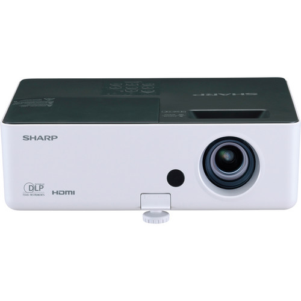

This class is mostly for the cheaper portable projectors that you might find in a small office or classroom. They often have a single lamp, are lighter, have less brightness options, and a lot less configuration options on their internal software. These ones can get you through certain installations in a pinch, but they aren't necessarily designed to be as easy to support in an installation setting as the next class up. Some projectors just don't handle 24/7 operation very well, so keep this in mind. You'll be somewhat limited on your range of options for throw ratios and image sizes because of the limited brightness ranges at this price point. Some of them have very limited zoom adjustments, and no lens shift. You're more likely to find cheap ultra-short throw (&lt;0.7) projectors in this range, but their brightness leaves something to be desired any more than 5-8ft away from the surface.

And unless it's dark DARK night time and your screen is a reasonable size, don't even think about using these outside.

##Installation and Home Theater projectors
Price Range: $2000 - $10,000
Brightness range: 3000-10000 lumens
Resolution range: 1024x768 to 1080p
<a href="http://www.bhphotovideo.com/c/product/917560-REG/panasonic_pt_dw640us_wxga_dlp_6000_lumens.html">Example</a>

It's hard to cover this class concisely as there are a wide range of brands, lenses, and imaging elements. These will be the go-to for 90% of projects. They will cover you in most indoor installations if you're trying to cover a reasonable amount of space (ambient light and windows permitting). These ones tend to be heavier and larger (15lbs+) but offer more configuration options than the portable class (like advanced geometry correction, control over LAN). They are also designed for 24/7 operation so they are more acceptable to use for long term installations. Some models also support multiple lamps so that in case one burns out, it can switch to another one. Maintenance and support is generally easier with these as well, but at an obvious jump in price.

These projectors also start to bring in multiple lens options for short throw 0.4 to long throw 12.0 ratio with the same body. They also offer more options for lens zoom and lens shift which are super handy.

If you're trying to get more than a 20ft wide image or are dealing with stage lighting, see my section below about properly calculating brightness and size before you drop your coins on a specific one.

You're also much more likely to buy one of these projectors for a short run than rent one. If you are running and installation for a week or more, it quickly becomes more cost effective to just purchase one of these classes of projectors (or the portables) because you would be paying the same amount in a week or so anyway.
##Large venue projectors
Price Range: $5000 - $Infinity
Brightness Range: 5000 lumens to 42,000 lumens (I've heard 100k lumens before, but can't find a reference)
Resolution Range: 1024x768 to 4K
<a href="http://www.barco.com/en/Products-Solutions/Projectors/Large-venue-projectors/20000-lumens-1080p-HD-3-chip-DLP-projector.aspx">Example</a>

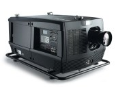

These ones can range from a form factor of about 2ft x 2ft x 8in all the way up to the size of a kitchen refrigerator. As brightness increases, so does the price and the space/ventilation/power requirements (and weight!). Another consideration is that at a certain point (around 15k lumens), 120V/15A mains just won't cut it for a single projector, and you'll need an electrician or special setup (240V/3 phase in US) to actually power the beast.

The high powered bulbs in these ones are also much more of a safety issue. When choosing a 20k versus a 30k rental for an event, I was told a professional projectionist would need to install the bulb in the 30k as it was unsafe to transport the projector with the expensive and fragile bulb inside. I was also told a fire marshall may need to be present to approve the safe operation of the projector as it presented a more significant fire hazard. The power of the bulbs also significantly shortens their lifespan down to about 1000 hours of operation compared to the smaller ones. The aging of these bulbs also has a much more noticeable effect on the image. Older bulbs will look much dimmer and more off color than brand new bulbs - something to keep in mind if you're working with multiple high power projectors is to keep an eye on bulb life.

Placement and mounting of these projectors is another important consideration. Some of the larger ones weigh 300+ lbs and will require trussing and investigation about whether the ceiling or structure can actually support them. For some events you may end up constructing a scaffold tower with the huge projector on top, and with your power supplies, media servers and workspaces underneath.

Like installation projectors, large venue projectors often offer multiple lens options for the same projector. Most offer throw ratios from 0.8 to about 7.0 or 12.0. These super zoomed ratios are helpful if you have a really tall building to projection map from the ground, or a screen that is over 100ft away and you're trying to conserve your precious photons.

You're also more likely to have to rent one of these projectors rather than purchase, so be prepared to source a rental house (who often require pricey production insurance, a solo artist will find it difficult to rent one!). Also owning one of these would be a pain because they are heavy, awkward, expensive to maintain, and you would need to rent them out yourself in order to break even. Prices vary on length of rental and type of equipment. From personal experience, I can tell you that a 20k lumen projector will run you roughly $1000-1500/day (including your lens choice), and 6k-10k lumens run around $700-1000 a day depending on lenses and HD requirements.

I wouldn't suggest planning to rent one of the larger ones for a long term installation unless you have some serious budget. The prices to purchase these shoot up sharply after about 10k lumens. Most 20k lumens and above will run you $40,000 to $80,000 and beyond.
#How to calculate projector intrinsics/read a spec sheet
Being able to interpret a projector spec sheet is an invaluable skill to have when planning your project. You'll have to separate the parts that are important, from the values that aren't standardized or are there for marketing fluff-
###Image
<b>Resolution:</b> This is the actual maximum resolution the projector is capable of displaying. You can send it higher resolutions than this, but the physical number of pixels will remain the same. If it's native resolution is 1280x800 and you send it 1080p, there is just going to be down sampling to match native resolution. If you see the spec "Supported Resolutions"  - Warning! This spec is nearly useless and incredibly misleading. Only pay attention to the native resolution if you want the physical pixel count. Supported resolutions just means the resolutions that the projector is capable of accepting and then down sampling or up sampling to match its native resolution. There are 1024x768 native projectors that "support" 1080p but that doesn't mean all those pixels are actually coming out of the lens.

<b>Lumens:</b> This spec is somewhat standardized with ANSI units, but different manufacturers can waver a bit. A difference of a couple hundred lumens between projectors isn't much to consider if you need something slightly brighter, it's easier to think in 1000 lumen increments generally. Also, as a guidance, you'll want at minimum around 20 lumens per square foot of image.

<b>Contrast Ratio:</b> This is another misleading/non-standardized unit. Ideally this will tell you the dynamic range or number of black pixels you would need to "stack" on top of eachother to make a white pixel. 1:300 contrast ratio is poorer than 1:10,000 but companies use different ways to quantify their contrast, so it can be very hard to gauge what the reality is until you get one. Some projectors also have dynamic contrast which means that they automatically adjust their lens to provide darker blacks depending on the image that is coming through. Bit depth is also loosely related to contrast, but it is more of a limitation within video technology than the projector technology. Bit depth (8bit,10bit etc) would be the number of possible "steps" between a black and white pixel.

<b>3D:</b> Occasional marketing fluff spec - read specs carefully if you really need 3D. Many projectors are "3D capable" if they have HDMI. Some of them operate at 120hz and work with active shutter glasses, but some setups you will need 2 projectors and some <a href="http://www.mtbs3d.com/phpBB/viewtopic.php?f=26&amp;t=509">special polarizing filters</a> and silver screens to actually make it work as well as a movie theater. Essentially, plan on extra equipment if you're looking to do 3D, or read very carefully.

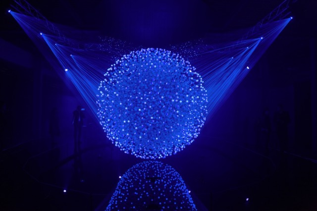

<small><a href="http://www.creativeapplications.net/featured/fluidic-sculpture-in-motion-by-whitevoid/">Fluidic</a> – Sculpture in Motion by WHITEvoid</small>
###Geometry</h3>
<b>Throw ratio:</b> This is probably the second most important specification behind lumens. This value gives you the ratio of the width of the projected image to the distance from the surface. For example, a throw ratio of 1:1 means that for every 1ft away from the wall, you will get 1ft of image width (and your height is determined by the aspect ratio). Sometimes this is given as some random unit like "66" @2m" which is usually diagonal size of the image at a certain distance. Lens zoom is also a related property because it allows you a small "variable" lens shift.

<b>Lens Shift:</b> Lens shift is generally only available on higher end projectors. Most projectors have a slight lens offset that allows them to be below or above their screen and still have a square image (different than tilting!). Lens shift allows you to correct for this offset if necessary - just tilting the projector would result in more keystoning. Some have manual or motorized lens shift. This also lets you worry less about exact placement of your projector because you will be able to shift the beam around - just watch for vignetting on the edges!
###Physical
<b>Inputs:</b> Make a note of these to make sure you have options with VGA or HDMI or whichever. We will discuss analog versus digital connections further down.

<b>Watts/Power Consumption:</b> This is important to have on hand if you're wondering if you might blow a circuit by running multiple projectors. See below on how to calculate it.

<b>Size/Weight/Noise Level:</b> Always good to know your dimensions if you need to fabricate a special box or fit it into a tight area. Weight is also very good to know for when you're choosing mounts or calculating whether the ceiling can hold the thing. Also good to note how loud a projector is going to be if you're doing a quiet/sound based installation - I've heard some loud ones before

Quick note about power consumption - it's always good to know off hand how much power your event or installation setup requires. In the US most electrical outlets are 120V/15A, EU is 240V/16A generally. Most spec sheets will give your projector power consumption in watts (sometimes as: eco power mode, normal, and lamp-on). Once you have the number of watts and you know the voltage of the electrical outlets, you can calculate how many amps you need so that you don't trip the circuit you're running off of. The equation is:

<i>Watts/Volts = Amps</i>
<i>300W(projector power consumption)/120V(supply voltage from outlet) = 2.5Amps</i>

You could potentially run 5 (12.5A) of these theoretical 300W projectors on a single 15A circuit. Always leave yourself some headroom with power demands - know in advance if you need more dedicated circuits. Some projectors also may need a larger pull of power when they first spark the lamp, so keep that in mind when powering up.
#Working with Throw Ratio
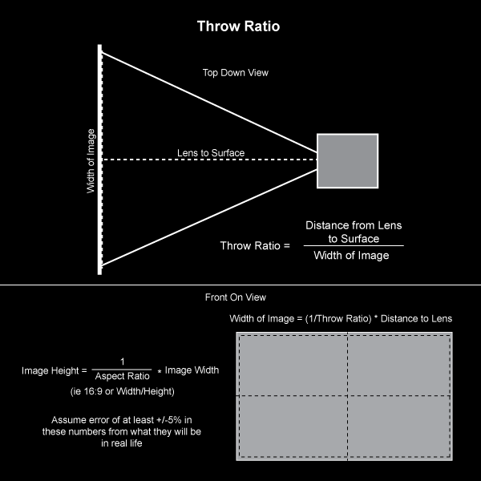

Now let's talk about throw ratio and how you can make it work for you. Feel free to use the many online <a href="http://www.projectorcentral.com/projection-calculator-pro.cfm">projector calculators</a> and <a href="https://itunes.apple.com/us/app/projector-screen-calculator/id575996442?mt=8">apps</a> - but it's good practice to run the numbers yourself. Sometimes the online calculators don't have the applicable options or sort of obfuscated results expressed in odd units or diagonal size (help me, Pythagoras). Using your throw ratio only, you can easily calculate the image width and height for a given distance.

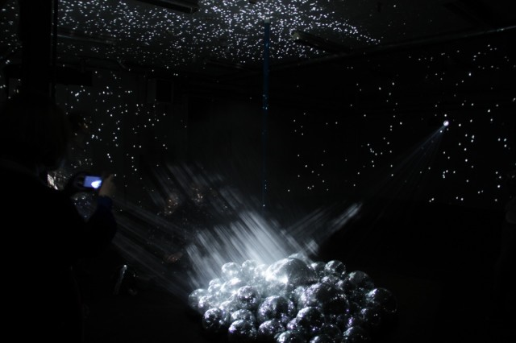

<small><a href="http://www.creativeapplications.net/environment/light-leaks-filling-a-room-with-projected-light/">Light Leaks by Kyle McDonald and Jonas Jongejan</a> – Filling a room with projected light</small>

<i>Throw ratio = distance from surface/width of image </i>
<i>0.5=2/x or at 2ft from a wall with a 0.5 throw ratio makes an image that is 4ft wide</i>

From this value we can also get the height of the image if we know the aspect ratio (eg 16:9 or 4:3) of what we are planning to project (or the aspect ratio of the projector's native resolution)

<i>Image height = (1/aspect ratio) * Image Width</i>
<i>From the above example, if we have 0.5 throw 2ft away with a 16:9 aspect ratio, what is our height?</i>
<i>Height = 1/(16/9) * 4 =  2.25ft</i>

Now that we know the width and height of our image, we can now easily calculate the answer to the question covered in the next section: "Is this going to be bright enough?" You can also use this value to calculate the angle of the projection frustum on the horizontal and vertical if you're curious about how close people can get to the projection surface before they start causing shadows. You'll need to know the projector offset to get really exact about this though - most projectors don't come 100% straight out of the lens without lens shift.

Please note to always calculate things to be bigger than you need them to be by a few percentage points. Manufacturers numbers can be slightly off, or your placement may need to shift slightly. Giving yourself an extra +/- 5% of image could be really helpful. Be careful not to overshoot too much and throw away resolution and brightness though - try to hit that sweet spot.
<h1>How to calculate projected brightness:</h1>
There are a few different ways to measure brightness of a projected image. One way to think of projected light is as a paint bucket full of a finite amount of photons. You're always going to have the same amount of light-paint, but the more you spread it, the "thinner" the coat gets, subsequently dropping brightness. Our primary concern is our lumens per square foot ratio, as this is the value that really changes the final output. This is just calculated as:

<i>Total Lumens/Area of projection</i>
<i>2000Lumens/40 sq feet of projection surface = 50lumens/square foot</i>

Ideally (and anecdotally) you want to stay above a minimum value of around 20lumens/square foot (or around 215 lumens/sq. meter). Once you dip below that value, you run the risk of your brightness and contrast being so weak that your image is washed out or unacceptably dim in less than ideal conditions.

There are many factors that can alter the eye's perception this calculated value including:
<ul>
	<li>Screen type/Screen gain - reflectivity of the screen</li>
	<li>Surface type - May be the side of a building, or a block of wood, or a regular white vinyl screen.</li>
	<li>Ambient light - dim gallery, bright show room, etc</li>
</ul>
Your type of surface can also affect your total brightness and contrast. Walls, screens, building exteriors, scrims, front or rear are all decisions that carry their own potential issues. Avoid really dark surfaces at all costs, as they absorb much of your photons and don't reflect as many. However, in some situations gray screens are preferable over white screens because the gray can absorb more of the ambient light and improve contrast.

Rear projection can also cost you some brightness depending on the materials you're projecting through. Rear projection has the side effect of giving you a fat hotspot right in the middle of your screen where the projector bulb is. To avoid the hotspot effect you need a rear projection material that can really diffuse the light at the expense of photons and contrast. A low gain screen will diffuse the light more and make it more even with rear projection but it will decrease the overall contrast because it also picks up more of the ambient light. A low gain screen is as efficient as a high gain screen, but it spreads the photons out to more viewing angles, so not as many are concentrated coming straight out at the average viewer. A high gain rear projection screen will seem a little more "transparent" which will improve contrast, but you will get a larger hotspot in the center. There are also specialized screens like 3M's Vikuiti film that uses a light absorbing layer and glass beads to provide an ideal experience of limited hotspot and while also absorbing ambient light for really deep blacks.

You can use a <a href="http://www.aemc.com/products/html/moreinfo.asp?id=70103&amp;dbname=products">light meter</a> to determine the ambient light in your space so you know what your reference point is. Once you know this value, you have an idea of the brightness you'll need for your projection to compete properly. You would need a light meter that measures in footlamberts to give you an easy to work with value for the ambient light in your space.  Personally, I have heard to try and make your brightness about 8 times brighter than expected room brightness so you can get acceptable contrast from the baseline of light in the room, but this is highly variable depending on your environment and intended effect. For example, an ambient light value of 5fl in a space would recommend a projected value of around 40fl to compete properly. You can obviously get away with less (or more), but keep these values in your pocket if they become necessary.

Stacking two matching projectors on top of each other does NOT mean the image will perceptually appear to be twice as bright. For example if you stack two 4000 lumen projectors, there are still 8000 lumens bouncing back at you, but your eye's perception of brightness is not linear, so it will not be seen as two times as bright - just brighter. You can also use the stacked projection to cover twice as much area with the same perceived brightness as using just one with half the square footage. Stacking also brings up the issue of brightening the black level with 2 stacked projectors, which in turn will change the perceived contrast between black and white and image quality. For optimal perception for your eyes, you want the projected image to have as much contrast from the surroundings as possible…there is a reason we watch movies in dark theaters.

To stack projectors you will ideally want ones in the installation or large venue class with motorized lens shift or ones that offer perspective distortion in their hardware - otherwise aligning the images of 2 projectors to be pixel perfect can be a nearly impossible feat. Access to lens shift is preferable, followed by the projector doing the actual distortion. You can do homography distortion in software to align the two, but then you'll need to essentially double your video output to output different streams.
#Video signal quality and cable lengths
Your video signal path is another very important consideration when planning. Analog and digital signals have their strengths and weaknesses. You will need to ensure your computer is compatible or you have the right adapters - especially if you're working with an existing projector system in a space (S-Video anyone?)
###DVI/HDMI
DVI and HDMI are the most common digital video cables right now. DVI can support a wide range of resolutions, and can handle the highest ranges with a dual link (DVI-D) cable. Single Link DVI is missing some of the center pins and has a lower bandwidth, it maxes out at 1920x1200 @60hz which is about 3.96gbit/s of data. Dual Link DVI cables are only technically limited by the copper bandwidth limits, DVI source limits and sync limits. Dual Link cables <a href="http://www.monoprice.com/Product?c_id=102&amp;cp_id=10209&amp;cs_id=1020902&amp;p_id=2760&amp;seq=1&amp;format=2">occasionally list</a> their bandwidth resolution limits of around 9.9gBits/second which you can use to check your intended use and how close you may be to hitting the ceiling.

<i>Resolution Width * Resolution Height = Total Number of Pixels</i>
<i>Total Number of Pixels * Refresh Rate = Total Number of Pixels per Second</i>
<i>Total Number of Pixels per second * Color resolution bits = Total Bits Per Second</i>

2560*1440 = 3,686,400 pixels
3,686,400 * 60hz = 221,184,000 pixels per second
221,184,000 * 24 (Bits of color) = 5,308,416,000 bits per second = 5.3gbit/s

I tend to trust DVI cables up to about 35ft, although the spec will get you to about 50ft. HDMI cables are more reliable at longer distances and have a larger consumer marker so it may be easier to find a reliable long cable. Symptoms of a digital cable that is too long or poor quality (or just not plugged in all the way!) will be something like:
<ul>
	<li>Unpredictable sync behavior</li>
	<li>Strange "noise" with the pixels, particularly in the blacks or on smooth gradients - this is a result of certain digital bits being flipped incorrectly because they weren't transmitted correctly over the cable. You can see this in the image below</li>
</ul>
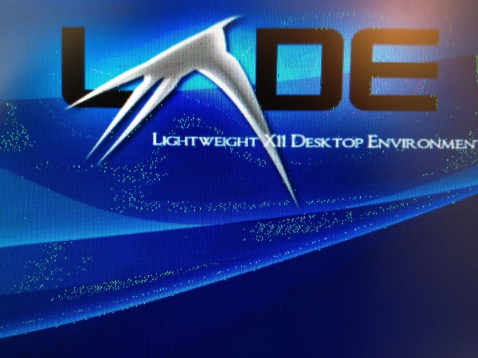

They sell longer HDMI and DVI, but unless it's really thick or your have had time to test it with your desired equipment, I would highly recommend an extender for distances over 100ft. Extenders come in different flavors and budget ranges, but it tends to be a case of "You get what you paid for" so don't expect a 20 dollar no-name brand extender to give you 100% reliability. There are signal boosting couplers, extensions over Cat5/Cat6, and extension over fiber optic. Cat5/Cat6 extenders can be used with VGA/DVI/HDMI but some of them can be especially finicky with certain output or display devices, so try and test as realistically as possible beforehand. Fiber optic extenders are top of the line because of their clean signal quality and ability to extend over 1000ft on a single cable. Fiber is VERY delicate (roughly handling it or kinking the cable can shatter the glass inside) and needs special considerations when running it. Fiber is also one of the more expensive extension options, so be prepared to rent your cable and extenders.

A final note is to pay attention to how your extender handles passing an EDID. An EDID is basically a packet of info that a video source and destination share that gives info about resolutions and timings. Without a proper EDID handshake, you'll be scratching your head "trying to figure out why this still isn't fucking working!" Some extenders send EDID over a separate Cat5 cable, so keep this in mind when constructing wiring diagrams. There are EDID Emulators and DVI Doctors that go in between a source and display. These devices can do things like "store" the EDID of a display and keep it in case you are going between your display and another device that disrupts the EDID like a switcher. Other DVI Doctors also work to clean up the DVI signal to make it easier to extend the signal, sort of like an amplifier.
<h2>SDI/HD-SDI</h2>
HD-SDI Cables are a great cable for sending video long distances. You'll commonly see them being used to send HD video from cameras into switcher and recording setups. They use a fairly common BNC barrel connector. You will often need a converter box to send your HDMI/DVI signal over HD-SDI since most computers don't offer that as an output option without something like a Black Magic card.
##VGA
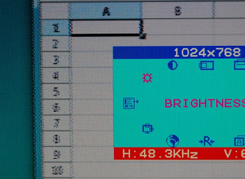

VGA is the most common analog cable that is still kicking around. It is still able to push 1080p and above at certain distances, but it will probably die out over the next decade as we transition to 4K. VGA cables are good in a pinch with lower resolutions at longer distances without boosters, but I wouldn't recommend them in professional use. The higher the resolution you're trying to shove down that copper pipe, the less potential success you'll have at getting your computer or projector to recognize the device at the other end because the same cable has to manage more bandwidth and needs a higher quality output device to generate the higher resolution clock timing for the analog signal. VGA also has the issue of analog distortion or a certain degree of "fuzziness" and color shifting because the colors are sent at different high speed clock frequencies, and this gets exacerbated on longer cables or on lower quality output devices. The inconsistency of analog can also mean you may get slight pixel offsets that you wouldn't get with a digital cable.
#Maintenance, miscellaneous caveats and tricks of the trade
##Maintenance tips:
NEVER (EVER!) UNPLUG A PROJECTOR with its lamp on. It can potentially destroy your expensive bulb! Projectors run their fans for a minute or two to cool the bulb in preparation for the next lamp on. If you unplug a hot projector, plug it back in and shock it with the electrical charge needed to spark it on, you risk damaging the delicate filament and either blowing your bulb out or severely reducing the lifespan. If you happen to unplug a projector while it is on, let it cool for 10-30minutes before turning it back on. Don't try to turn it back on hoping you can get the fan going or something.
<h2>Ventilation is important!</h2>
Projectors need to suck in new cool air, blow it over the bulb to absorb its heat, and then push it out another side. Without air flow, the bulbs temperature can rise to unsafe levels. Luckily, most projectors have detectors for this and will automatically shut off when their bulb temperature reaches a certain threshold. Still, you probably want to avoid having your projector auto-shutoff during an event or long running installation. Most manuals will also advise you not to run your projectors sideways in "portrait" mode because it will change the factory designed airflow and shorten bulb life - I haven't personally experienced a significant issue with running them portrait, but it is trickier to manage their air flow in this position. Some projectors also have a specific filament placement that can impact whether it is safe to run them in unusual configurations because the filament may not be centered within the bulb.
##Projector placement considerations
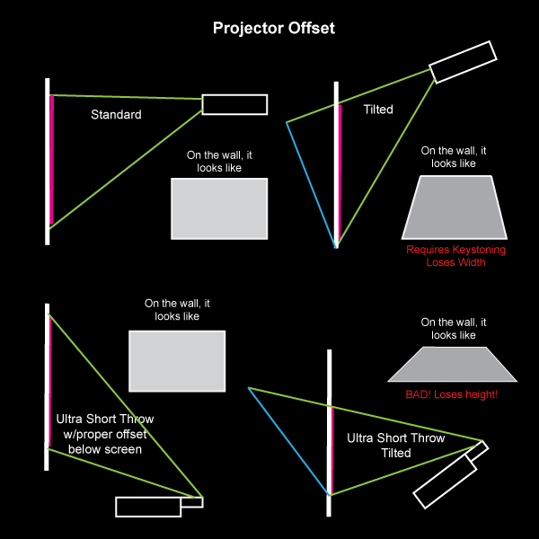

In the event that you can't get enough distance to get the desired image size, you have a few options. You can get multiple projectors and edge blend them (complex setup depending on your environment). A lot of consumer ultra short throws that are closer than 0.8 throw have setups so that they bounce the beam off a mirror and overtop of the projector to get every inch of possible distance. A mirror is a good way to extend the distance of your normal projector as well, with an important caveat: you need what is called a first surface mirror, or front surface mirror. A first surface mirror has the reflective coating on the top layer rather than underneath the glass. A normal mirror with coating on the backside will have a potential to give you a double image or color distortions because of the beams bouncing from the glass and the reflective surface.

Ultra short throws and mirror solutions have a noteable side effect to plan for: projection offset. I have experienced this a few times first hand until I figured out my mistake. When using these solutions, the projector will need to be either sigificantly above or below the center point of the desired screen. Sometimes they need to be almost 3-5 ft below the bottom or top of the screen itself. Trying to shoot these offset solutions straight out to the center will result in extreme warping and a reduction in image size (primarily height).

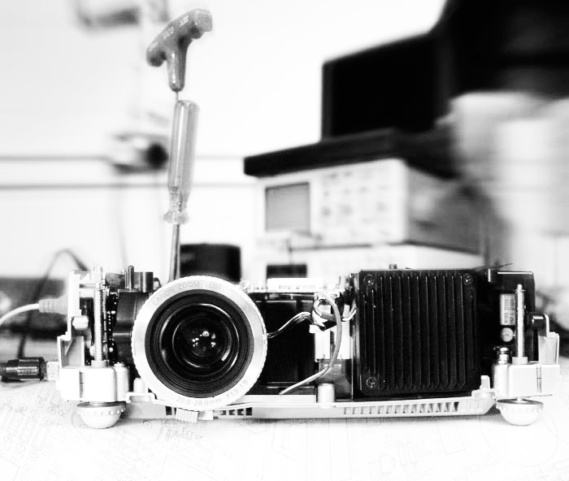

##Misc.
A wide angle/short throw lens will have the effect of giving you a lower depth of field which would be relevant if you are doing some kind of projection mapping that would have a lot of depth to it. The focus and brightness fall off much more quickly than with a longer throw lens, so mapping with these can be a challenge. 0.4 Throw to 0.8 throw is usually a lens solution, but 0.4 and less usually involves a curved mirror which limits your ability to focus on much more than a plane.
<h1>Experimental Tech and the Future</h1>
The following are some links to some equipment that would be fairly unusual to see in most major productions at the moment.

A big dream for a lot of us would be to have a projector with an embedded infrared camera that looks through the exact same lens as the projector in a 1:1 relationship so that there is easy alignment between camera and interactive content.

Texas Instruments DLP Dev kit for embedded projectors in other projects - <a href="http://www.digikey.com/product-highlights/us/en/texas-instruments-dlp-technologies/688">http://www.digikey.com/product-highlights/us/en/texas-instruments-dlp-technologies/688</a>

TI's Pico Projector with Ultraviolet light source - <a href="http://www.ti.com/devnet/docs/catalog/thirdpartydevtoolfolder.tsp?actionPerformed=productFolder&amp;productId=16180">http://www.ti.com/devnet/docs/catalog/thirdpartydevtoolfolder.tsp?actionPerformed=productFolder&amp;productId=16180</a>

Projection Design's 1080p Infrared Projector - <a href="http://www.projectiondesign.com/products/fs33-ir-series">http://www.projectiondesign.com/products/fs33-ir-series</a>

Sony's 4K Projector - <a href="http://www.cnet.com/products/sony-4k-ultra-short-throw-projector/">http://www.cnet.com/products/sony-4k-ultra-short-throw-projector/</a>

Projection Design's Remote Light Source - Allows for your light source to be a few meters away from your for space and noise concerns - only at around 2000 lumens right now: <a href="http://www.projectiondesign.com/corporate/press/projectiondesign-fr12-remote-light-source-projector-in-control-at-ons">http://www.projectiondesign.com/corporate/press/projectiondesign-fr12-remote-light-source-projector-in-control-at-ons</a>

Also, having a look at the DIY projector scene can give you some really interesting ideas. You can make an almost passable projector with an LCD screen and a fresnel lens surprisingly enough. <a href="http://www.instructables.com/id/homemade-projector-cornflake-box/step4/attach-magnified-glass/">http://www.instructables.com/id/homemade-projector-cornflake-box/step4/attach-magnified-glass/</a> &amp;&amp; <a href="https://www.youtube.com/watch?v=n_3RDuOV3qU">https://www.youtube.com/watch?v=n_3RDuOV3qU</a>

------
<h2>Thanks</h2>
..to Kyle McDonald, Chris Jordan, Zach Leiberman for providing input and reviewing the article. Huge thanks also to Elliot Woods who gave me a really helpful review with extra tips and probably the most hilarious point by point commentary on the article.
<h2>Other resources to check out:</h2>
Wikipedia for DLP: <a href="http://en.wikipedia.org/wiki/Digital_Light_Processing">http://en.wikipedia.org/wiki/Digital_Light_Processing</a>

On the maximum length of VGA: <a href="http://www.wirelessforums.org/alt-comp-hardware/max-resolution-vga-connector-22437.html">http://www.wirelessforums.org/alt-comp-hardware/max-resolution-vga-connector-22437.html</a>

Da-Lite's (somewhat dated) articles on projection: <a href="http://www.da-lite.com/education/angles_of_view.php">http://www.da-lite.com/education/angles_of_view.php</a>

Using light meter to determine brightness: <a href="http://www.avsforum.com/t/755705/using-the-ca813-light-meter-to-measure-your-front-projector">http://www.avsforum.com/t/755705/using-the-ca813-light-meter-to-measure-your-front-projector</a>

Digital projector myth: <a href="http://www.kenrockwell.com/tech/digital-projector-myth.htm">http://www.kenrockwell.com/tech/digital-projector-myth.htm</a>

3 types of projectors explained: <a href="http://forums.afterdawn.com/thread_view.cfm/74117">http://forums.afterdawn.com/thread_view.cfm/74117</a>

<a href="http://www.engadget.com/2012/04/16/redray-4k-cinema-laser-hands-on/">http://www.engadget.com/2012/04/16/redray-4k-cinema-laser-hands-on/</a>

Remote light source: <a href="http://www.projectiondesign.com/products/fr12-series">http://www.projectiondesign.com/products/fr12-series</a>

Top 10 Pico: <a href="http://www.projectorcentral.com/popular-pico-projectors.htm">http://www.projectorcentral.com/popular-pico-projectors.htm</a>

Reading about LCoS: <a href="http://www.projectorcentral.com/lcos.htm">http://www.projectorcentral.com/lcos.htm</a>

Discussion about stacking projectors: <a href="http://forums.prosoundweb.com/index.php?topic=96088.0">http://forums.prosoundweb.com/index.php?topic=96088.0</a>

<a href="http://www.electricstuff.co.uk/picoproj.html">http://www.electricstuff.co.uk/picoproj.html</a>

Should you use white or gray screens? - <a href="http://www.projectorcentral.com/white_gray_projection_screens.htm">http://www.projectorcentral.com/white_gray_projection_screens.htm</a>

What is Screen Gain? -<a href="http://www.projectorcentral.com/projector_screens_gain.htm">http://www.projectorcentral.com/projector_screens_gain.htm</a>

Brightness - <a href="http://www.projectorcentral.com/home_theater_projector_buyers_guide.htm?page=Brightness">http://www.projectorcentral.com/home_theater_projector_buyers_guide.htm?page=Brightness</a>

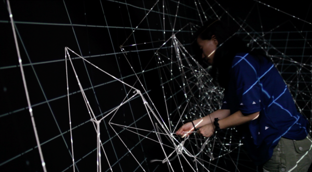

<a href="http://www.kimchiandchips.com/works.html#LSS" target="_blank">LINE SEGMENTS SPACE by Kimchi and Chips</a>, 2013 / Projection, Nylon string, Code.